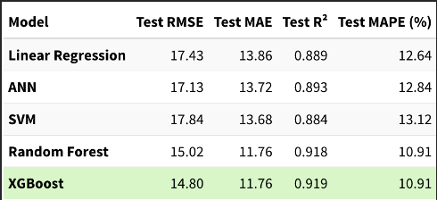

# Amazon Delivery Efficiency Analytics

## Project Overview
This project analyzes Amazon delivery operations to identify the key factors affecting delivery efficiency and customer satisfaction. The analysis includes data preprocessing, feature engineering, exploratory data analysis, and machine learning modeling.

## Objectives
- Identify factors causing delivery delays
- Analyze operational and environmental impacts on delivery performance
- Compare machine learning models
- Generate business insights for logistics optimization

## Technologies Used
- Python
- R 
- Pandas
- XGBoost
- Machine Learning
- Data Visualization

## Model Performance Comparison

